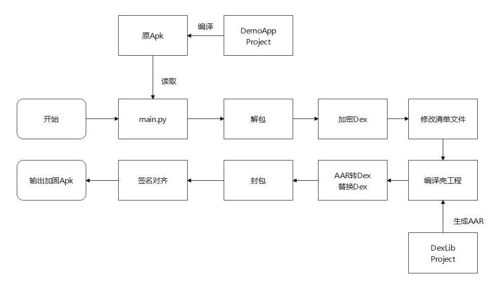
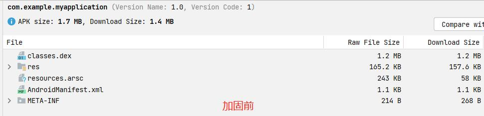
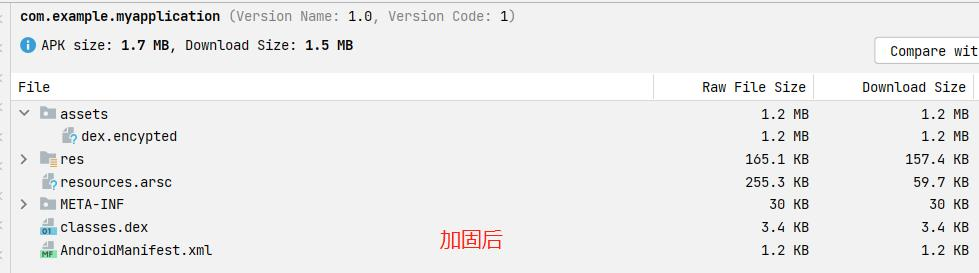

# Android一键加固

Python脚本一键加固App，动态生成Classes.dex壳，支持修改替换


## 环境配置

以下是我的测试环境，并不代表需要完全一样

- **python** 3.10
- **jdk** 17
- **apktool** 2.9.0
- **zipalign/apksigner/d8** build-tools/33.0.2


## 使用方法

1. 修改main.py中``main``方法的路径配置

   ```python
   # 下面是需要配置的环境信息
   apktool_path = "./thirdpart/apktool.jar"
   zipalign_path = "./thirdpart/zipalign"
   apksigner_path = "./thirdpart/apksigner.jar"
   d8_path = "./thirdpart/d8.bat"
   ```

2. 运行main.py中的``main``方法


## 目录说明

- **demoApk**：demo-app-release.apk的源工程，即原apk的示例工程
- **dexLib**：加固后的Apk入口的classes.dex的生成工程，可以根据实际修改
- **images**：Readme文档的说明图片
- **demo-app-release.apk**：预编译的原始APK
- **install_demo.bat**：安装原始的APK脚本
- **install_output.bat**：安装加固的APK脚本（必须运行main.py后执行）
- **main.py**：主要的加固脚本demoAPK的签名文件，其中密码：12345678，别名：12345678
- **TestKeyStore.jks**：测试打包用
- **thirdpart**：存放第三方工具的默认目录，不在git管理之中，可以自行修改配置目录
- **example_unpack**：解包后生成的文件夹
- **demo-app-output.apk**：最终输出加固签名APK


## 主要流程

脚本流程如图所示：




## 预览

下面是加固前：



下面是加固后：




## 更多信息

请参考源码


